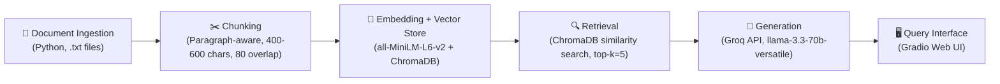

# Project 1 Planning: The Unofficial Guide

> Write this document before you write any pipeline code.
> Your spec and architecture diagram are what you'll use to direct AI tools (Claude, Copilot, etc.) to generate your implementation — the more specific they are, the more useful the generated code will be.
> Update the Retrieval Approach and Chunking Strategy sections if you change your approach during implementation.
> Update this file before starting any stretch features.

---

## Domain

Minerva University student favorite spots — cafes, restaurants, and study spaces — across all six rotation cities: San Francisco, Seoul, Hyderabad, Berlin, Buenos Aires, and Taipei. This knowledge is valuable because Minerva students rotate to a new city every semester, arriving with zero local knowledge about where to eat affordably, where to find reliable wifi for study sessions, and which tourist-trap spots to avoid. Official university channels provide generic city orientation materials but never cover the hyper-specific, opinion-based details that actually matter: which cafe has outlets at every table, which kebab shop is worth a 30-minute line, or which night market stalls are student-budget friendly. This information lives in ephemeral Discord messages, WhatsApp groups, and word-of-mouth — it's hard to find and easy to lose when students graduate.

---

## Documents

| # | Source | Description | URL or location |
|---|--------|-------------|-----------------|
| 1 | sf_cafes_study_spots.txt | SF cafe reviews with wifi quality, outlet availability, and study vibes | documents/sf_cafes_study_spots.txt |
| 2 | sf_affordable_restaurants.txt | SF budget restaurant reviews with pricing and portion details | documents/sf_affordable_restaurants.txt |
| 3 | berlin_cafes_study_spots.txt | Berlin cafe reviews focused on wifi speed and coworking vibes | documents/berlin_cafes_study_spots.txt |
| 4 | berlin_affordable_restaurants.txt | Berlin budget food including döner, ramen, and street food | documents/berlin_affordable_restaurants.txt |
| 5 | seoul_cafes_study_spots.txt | Seoul study cafes and coffee shops with hourly pricing | documents/seoul_cafes_study_spots.txt |
| 6 | seoul_affordable_restaurants.txt | Seoul street food, markets, and budget restaurants | documents/seoul_affordable_restaurants.txt |
| 7 | taipei_cafes_and_food.txt | Taipei cafes for studying plus night market food guide | documents/taipei_cafes_and_food.txt |
| 8 | hyderabad_cafes_and_food.txt | Hyderabad cafes, biryani spots, and street food | documents/hyderabad_cafes_and_food.txt |
| 9 | buenos_aires_cafes_and_food.txt | Buenos Aires cafes and affordable parrillas/empanadas | documents/buenos_aires_cafes_and_food.txt |
| 10 | cross_city_comparison.txt | Student survey ranking wifi speeds and food value across all cities | documents/cross_city_comparison.txt |
| 11 | new_student_survival_guide.txt | First-week food strategy and dietary restriction guide per city | documents/new_student_survival_guide.txt |

---

## Chunking Strategy

**Chunk size:** 400–600 characters

**Overlap:** 80 characters (~15-20% overlap)

**Reasoning:** The documents are structured as individual venue reviews — each review block typically runs 3-6 sentences (200-600 characters) containing a venue name, rating, specific opinions, and practical details (price, wifi quality, hours). A chunk size of 400-600 characters is large enough to capture one complete review with its context (venue name + student opinion + practical detail) but small enough to avoid merging unrelated venues into the same embedding. The 80-character overlap ensures that if a review spans a chunk boundary, the venue name or a key detail from the start of the review carries into the next chunk, preventing orphaned fragments. I'll split on double-newlines (review boundaries) first and fall back to character splitting only when a single review exceeds the max chunk size. This paragraph-aware approach respects the natural structure of the documents rather than blindly splitting at fixed intervals.

---

## Retrieval Approach

**Embedding model:** `all-MiniLM-L6-v2` via `sentence-transformers` (runs locally, no API key)

**Top-k:** 5

**Production tradeoff reflection:** If deploying for real Minerva students at scale, I would weigh several factors:
- **Context length**: `all-MiniLM-L6-v2` has a 256-token limit, which works for our short review chunks but would struggle with longer documents. A model like `all-mpnet-base-v2` (768 tokens) or OpenAI's `text-embedding-3-small` (8191 tokens) would handle more context per chunk.
- **Multilingual support**: Our documents include Korean, Mandarin, Hindi, German, and Spanish terms (venue names, food items, phrases). A multilingual model like `paraphrase-multilingual-MiniLM-L12-v2` would better handle queries that use non-English terms (e.g., "Where can I get 삼겹살?").
- **Cost vs. quality**: Local models are free but may have lower accuracy on domain-specific slang (e.g., "GOAT", "goated", "mid"). API-hosted models like OpenAI's embeddings offer higher quality but add per-request cost and network latency.
- **Latency**: For a real-time query interface, local inference (~10ms) beats API calls (~100-500ms). At our small document scale, local is clearly better.

---

## Evaluation Plan

| # | Question | Expected answer |
|---|----------|-----------------|
| 1 | Which cafes in Berlin have the best wifi for long study sessions? | St. Oberholz (100+ Mbps, outlets everywhere, mentioned as "unofficial Minerva campus") and Five Elephant in Kreuzberg (strong wifi, good outlets). Bonanza Coffee also good but slower wifi. Avoid Einstein Kaffee and Balzac. |
| 2 | What is the cheapest filling meal a student can get in Hyderabad? | Street dosa at Ram Ki Bandi for ₹80 (~$0.96), idli/dosa/vada at tiffin centers for ₹30-50, or breakfast at local joints for ₹100 (~$1.20) unlimited. Hyderabad is the cheapest Minerva city for food. |
| 3 | Which San Francisco restaurants are affordable and filling for students on a budget? | Señor Sisig (Filipino-Mexican burritos, ~$12, massive portions), El Farolito (super burrito $13, open until 3am), Tu Lan (Vietnamese plates $10-12, huge portions), and Dumpling Home (soup dumplings $12-20 for a full meal). |
| 4 | Are there any 24-hour study spots in Seoul? | Yes — Café Comma is open 24 hours with unlimited coffee included for ₩2,000-3,000/hour (~$1.50-2.25). Korean study cafes (스터디카페) are also 24/7 in many locations with private booths, outlets, and free drinks. |
| 5 | Which places should students avoid eating at in Buenos Aires? | Avoid Puerto Madero (tourist trap, 3x normal prices) and restaurants on Calle Florida (designed for tourists, terrible value). Café Tortoni is overpriced for the food quality (though worth visiting once for the history). |

---

## Anticipated Challenges

1. **Cross-document retrieval confusion**: Some queries (like "best wifi across cities") require information scattered across multiple documents. The retrieval might return chunks from only one or two cities, giving an incomplete answer. The cross-city comparison document helps mitigate this, but the LLM may still miss relevant city-specific details from individual documents.

2. **Foreign language terms in reviews**: The documents contain Korean (삼겹살, 김밥천국), Mandarin (鼎泰豐, 蚵仔煎), Hindi terms, and German/Spanish phrases for venues and dishes. The `all-MiniLM-L6-v2` model is English-focused and may not embed these terms meaningfully, causing retrieval to miss chunks when a query includes non-English food or venue names.

3. **Venue name disambiguation**: Several documents mention the same venue in different contexts (e.g., Starbucks appears in SF, Seoul, and the comparison doc). A query about "Starbucks wifi" could retrieve chunks from the wrong city, leading to a confusing or inaccurate response.

---

## Architecture

**Pipeline flow:**
1. **Document Ingestion** — Load 11 `.txt` files from `documents/`, clean any stray formatting artifacts
2. **Chunking** — Split on double-newline boundaries (review blocks), then character-split oversized blocks at 600 chars with 80-char overlap. Attach source filename as metadata.
3. **Embedding + Storage** — Embed each chunk with `all-MiniLM-L6-v2`, store in local ChromaDB collection with metadata (source file, chunk index, city)
4. **Retrieval** — Given a user query, embed it and return top-5 most similar chunks from ChromaDB with distance scores and source metadata
5. **Generation** — Pass retrieved chunks as context to `llama-3.3-70b-versatile` via Groq API with a grounding system prompt; append source attribution programmatically
6. **Interface** — Gradio web UI with a text input, answer display, and sources panel

---

## AI Tool Plan

**Milestone 3 — Ingestion and chunking:**
I'll give Antigravity (Claude) my Chunking Strategy section and document structure (paragraph-separated reviews in .txt files) and ask it to implement an `ingest.py` that loads all documents and a `chunker.py` that splits on double-newlines first, then character-splits oversized blocks. I'll verify the output by printing 5 sample chunks and checking they're self-contained reviews, not fragments.

**Milestone 4 — Embedding and retrieval:**
I'll share my Retrieval Approach section and Architecture diagram and ask Antigravity to implement embedding with `SentenceTransformer("all-MiniLM-L6-v2")`, ChromaDB storage with metadata (source, city, chunk_index), and a retrieval function returning top-5 chunks. I'll test with 3 evaluation questions and verify distance scores are below 0.5.

**Milestone 5 — Generation and interface:**
I'll give Antigravity my grounding requirements (answer only from context, cite sources, refuse out-of-scope queries) and ask it to implement the Groq integration with a grounding system prompt, plus a Gradio interface with input/answer/sources fields. I'll verify grounding by testing an out-of-scope query and checking the system refuses to answer from general knowledge.
